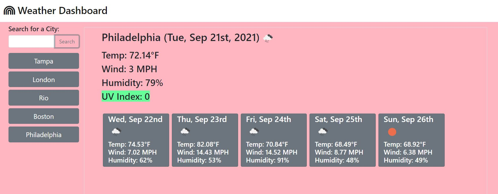

# weather_dashboard

## Description

I created this weather dashboard so users can search the weather for any city by name. Upon search, users are delivered the current weather data as well as a five-day forecast. The users' city search history is locally stored so they can go back to a previously searched city by simply clicking on it in the search history.  Through this project, I learned how to successfully work with a server-side API and create a working web application surrounding it. 

## Usage

Below is a picture of the weather dashboard:

The link to the weather dashboard is here: https://nicolepingar.github.io/weather_dashboard/

## Credits

I used two Open Weather APIs linked here:
https://openweathermap.org/current
https://openweathermap.org/api/one-call-api

## How to Contribute
Please find me on GitHub @nicolepingar or email me at nicolepingar@gmail.com.